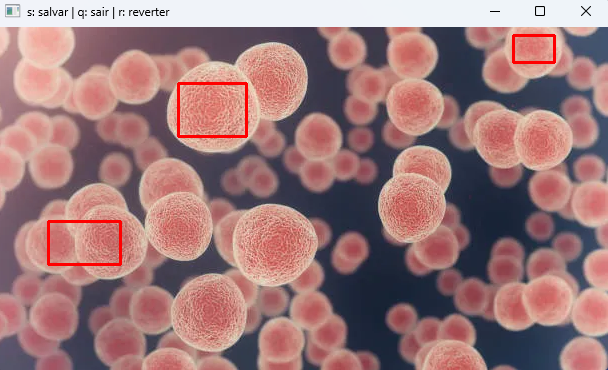

# Módulo Segmentation: Ferramenta de Segmentação por Cor
Este pacote fornece uma **CLI (Command Line Interface)** para segmentação de imagens e vídeo baseada em cores no espaço **HSV**, permitindo:

* **Chroma key** em imagens e webcam
* **Segmentação de objetos por cor**
* **Leitura interativa de cores** diretamente da imagem

Ele é útil para testes de segmentação.

---

## Instalação

clone do repositório:

```bash 
git clone "https://github.com/AbstractGleidson/croma.git"

cd croma 

pip install -e .
```

Após instalar o pacote (via `pip install`), o comando principal disponível será:

```bash
seg
```

Para ver todos os comandos disponíveis:

```bash
seg --help
```

---

## Estrutura Geral da CLI

```text
seg
├── chroma   # Chroma key em imagens
├── object   # Segmentação de objetos por cor
├── webcam   # Chroma key em tempo real (webcam)
└── color    # Leitura interativa de cor (HSV)
```

---

## Seg color

### Descrição

Abre uma janela interativa para **seleção manual de uma cor** em uma imagem.
Você pode selecionar **pontos** ou **regiões retangulares**, e o sistema calcula automaticamente os **valores mínimo e máximo em HSV**.

Ideal para descobrir os limites corretos de uma cor antes de usar segmentação ou chroma key.

### Uso

```bash
seg color --image imagem.png
```

### Controles da janela

* **Clique simples**: seleciona um ponto
* **Clique + arraste**: seleciona um retângulo
* **s**: salvar seleção
* **r**: limpar seleções
* **q**: sair sem salvar

### Saída

Exemplo:

```text
Valores mínimos:
  hue - 35
  saturation - 80
  value - 60

Valores máximos:
  hue - 85
  saturation - 255
  value - 255
```

---

## seg chroma

### Descrição

Aplica o efeito **chroma key** em uma imagem, removendo o fundo baseado em uma cor selecionada.

Você pode:

* Escolher a cor manualmente
* Usar uma cor pré-definida
* Substituir o fundo por outra imagem ou por uma cor sólida

### Uso

```bash
seg chroma --front pessoa.png
```

### Opções

| Opção           | Descrição                      |
| --------------- | ------------------------------ |
| `-f, --front`   | Imagem principal (obrigatória) |
| `-b, --back`    | Imagem de fundo                |
| `-c, --color`   | Cor do fundo (green, blue, red) |
| `-s, --save`    | Salva a imagem final           |
| `-v, --verbose` | Exibe valores HSV usados       |
| `-a, --assets`  | Procura as imagens na pasta assets do repositório


### Observação
O parâmetro `--color` aceita apenas as cores base:

- green
- red
- blue

Caso nenhuma cor seja informada, o comando abre automaticamente a janela interativa de seleção de cor, funcionando da mesma forma que o comando seg color.

### Exemplos

```bash
seg chroma --front pessoa.png --back fundo.jpg --save
```

```bash
seg chroma --front pessoa.png --color green --verbose
```

---

## seg object

### Descrição

Segmenta um **objeto específico** em uma imagem com base em uma cor selecionada.

O resultado é uma imagem onde apenas regiões da cor escolhida permanecem visíveis.
O comando abre um janela de seleção para a cor do objeto de interesse.

### Uso

```bash
seg object --image objeto.png
```

### Opções

| Opção           | Descrição                       |
| --------------- | ------------------------------- |
| `-i, --image`   | Imagem de entrada (obrigatória) |
| `-s, --save`    | Salva o resultado               |
| `-v, --verbose` | Exibe valores HSV               |
| `-a, --assets`  | Procura as imagens na pasta assets do repositório

### Exemplos

```bash
seg object --image objeto.png --save
```

```bash
seg object --image objeto.png --verbose
```

---

## seg webcam

### Descrição

Aplica **chroma key em tempo real** usando a webcam.

Você pode substituir o fundo da câmera por:

* Uma imagem
* Uma cor sólida

### Uso

```bash
seg webcam
```

### Opções

| Opção      | Descrição                     |
| ---------- | ----------------------------- |
| `--webcam` | Índice da webcam (default: 0) |
| `--back`   | Imagem de fundo               |
| `--color`  | Cor do fundo (default: green) |
| `--h`      | Altura da janela              |
| `--w`      | Largura da janela             |
| `-a, --assets`  | Procura as imagens na pasta assets do repositório

### Exemplos

```bash
seg webcam --color green
```

```bash
seg webcam --back fundo.jpg --w 800 --h 600
```

---

# Exemplos com assets do repositório
A seguir estão alguns exemplos utilizando imagens da pasta `assets/` do repositório
para demonstrar casos de uso da ferramenta de segmentação.

## 1. Chroma key segmentando a cor verde

```bash 
seg chroma -a --front=bandeira.jpeg --back=fundo.jpeg --color=green
```

### Imagem original


### Imagem segmentada


## 2. Chroma key segmentando a cor azul

```bash 
seg chroma -a --front=bandeira.jpeg --back=fundo.jpeg --color=blue
```

### Imagem original


### Imagem segmentada


## 3. Segmentação de objeto por seleção manual de cor

```bash 
seg object -a --image=celulas.jpeg
```

### Imagem original


### Seleção do objeto de interesse


### Imagem segmentada
